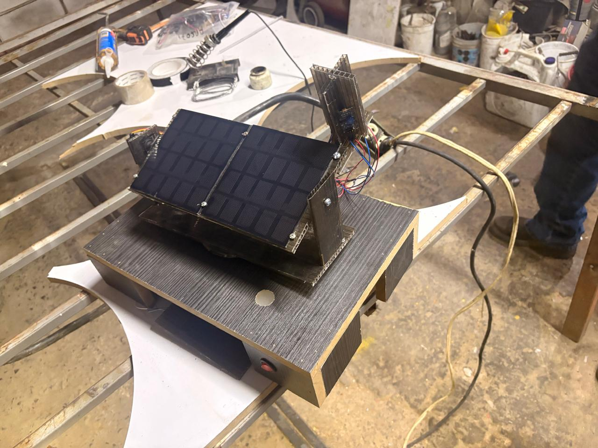
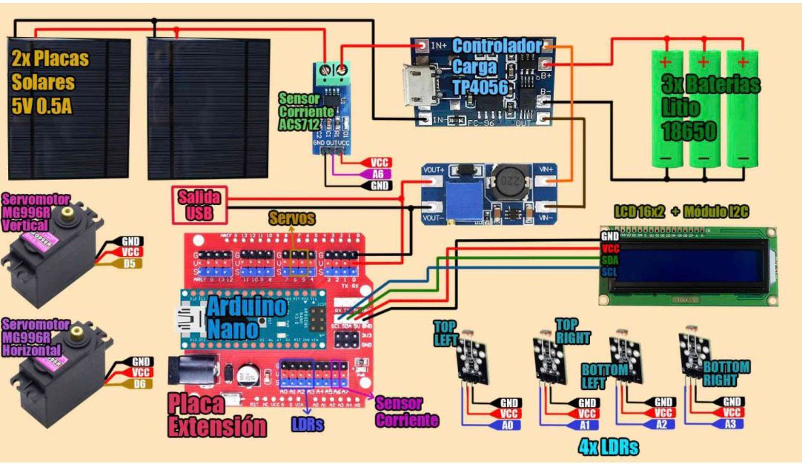
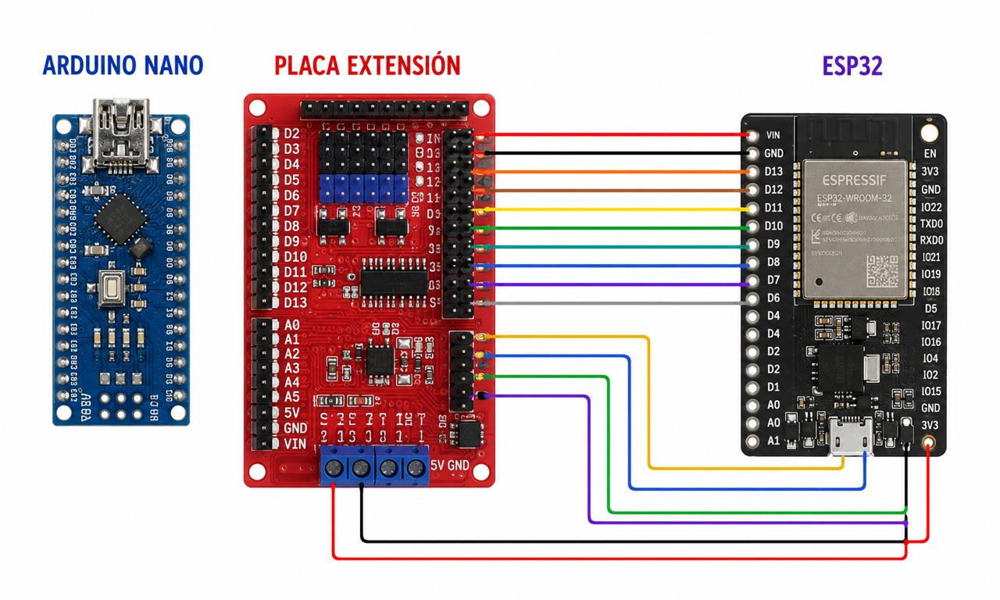

# SolarTrack IoT
SolarTrack IoT es un sistema de seguimiento solar inteligente desarrollado como proyecto académico.  
Combina hardware (ESP32/Arduino, sensores y servomotores) con un dashboard web conectado vía MQTT para monitorear en tiempo real la producción energética y la eficiencia de un panel solar.

## Características principales
- Seguimiento solar automático con servomotores en dos ejes (horizontal y vertical).
- Registro de intensidad solar, corriente, nivel de batería y eficiencia.
- Conexión WiFi + MQTT para envío de datos en tiempo real.
- Dashboard web con métricas dinámicas, gráficas comparativas y exportación CSV.
- Sincronización automática de datos cuando el dispositivo recupera conexión.

## Estructura del repositorio
- **arduino/** → Código del microcontrolador (ESP32/Arduino).
- **web/** → Código del dashboard web (HTML, JS, CSS).
- **docs/** → Diagramas de circuito y arquitectura del sistema.

## Hardware utilizado
- ESP32
- Arduino UNO  
- 2 panel solar 1.9W 135x130 mm 5V 380mA con cables soldados
- XS-170 Modulo de Expanción
- 1 sensor de corriente ACS712 30A
- TP4056 Cargador de baterias tipo C 5V
- 3 Baterias 18650 3.7V
- Display LCD 16x2 con I2c fondo azul
- MT3608 Elevador de voltaje Boost Step Up 6W 2A
- Nano 3.0 con cable USB
- 2 MG996R Servomotor Engranes de metal
- 4 Módulos sensores Fotoresistor LDR
- Interruptor Redondo KCD2 Rojo
- 2 metros de cable eléctrico 22 AWG Negro PVC
- 2 metros de cable eléctrico 22 AWG Rojo PVC
- 2 Juegos de Cables dupont largos 20cm
- Conector USB Hembra Tipo A 4 pines
- Porta pilas 18650 3 pilas
### Imagen del circuito

## Materiales de construcción
Además del hardware electrónico, el circuito fue montado con materiales prácticos y resistentes:
- Madera como base estructural.  
- Barniz UV para proteger la superficie contra la intemperie.  
- Tornillos y soportes metálicos para fijar componentes.  
- Silicón caliente para aislamiento y fijación rápida.  
- Cautín y soldadura para las conexiones eléctricas.  
- **Policarbonato solar** (plástico especial resistente a radiación UV) utilizado en los postes que sostienen el panel y los sensores LDR.
- Puedes usar cualquier material de tu elección, ya sea como en nuestro caso madre, puede ser plástico, metal, cartón o hasta impresiones 3d, solo considera el peso y la resistencia al sol.
### Circuito simplificado

## Diagrama del circuito
### Arduino con todos los componentes (sin ESP32)

### Arduino + placa de expansión (con ESP32)

## Ejecución y funcionamiento del sistema
El circuito se comporta de manera integrada y autónoma:

1. **Carga y alimentación**  
   - El panel solar genera energía y carga la batería a través del módulo de gestión.  
   - El sistema puede operar incluso con variaciones de luz gracias al almacenamiento.  

2. **Seguimiento solar**  
   - Los sensores LDR detectan la intensidad de luz en diferentes direcciones.  
   - Los servomotores ajustan la posición del panel en dos ejes para maximizar la captación.  

3. **Medición y registro**  
   - El sensor ACS712 mide la corriente generada.  
   - La pantalla LCD muestra en tiempo real los valores de energía y estado del sistema.  

4. **Comunicación IoT**  
   - El Arduino gestiona el control del circuito.  
   - El ESP32 se encarga de la conexión WiFi y el envío de datos vía MQTT.  
   - Los datos se transmiten al dashboard web, donde se registran métricas, gráficas y se pueden     exportar en CSV.  

5. **Sincronización inteligente**  
   - Si el dispositivo pierde conexión, almacena los datos localmente.  
   - Al recuperar internet, sincroniza automáticamente con el servidor para no perder información.

 6. **Carga de dispositivos externos**  
   - El sistema puede alimentar y cargar pequeños dispositivos electrónicos como **teléfonos móviles, smartwatches, sensores portátiles o gadgets IoT**.  
   - Esto convierte al circuito en una solución práctica para aplicaciones de energía autónoma en campo.  

👉 En conjunto, el sistema **carga, regula, mide, registra y transmite** todo el flujo energético, mostrando en el dashboard un monitoreo confiable y en tiempo real.

## Licencia
Este proyecto está bajo la licencia MIT. Puedes usarlo, modificarlo y compartirlo libremente.
